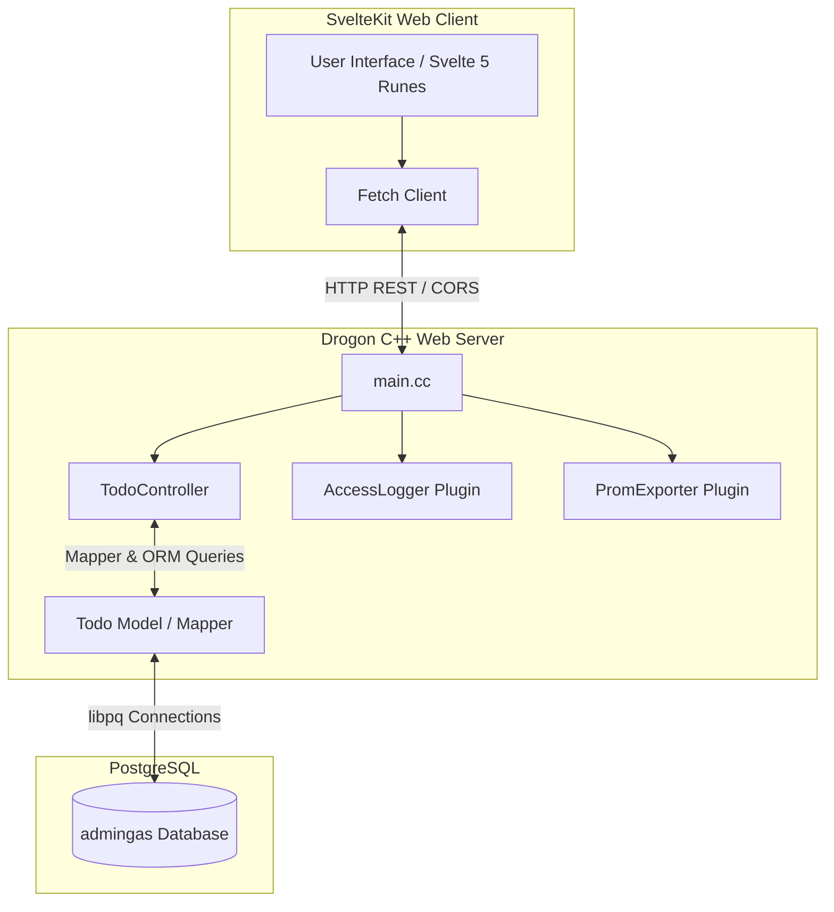

# AdminGas System Architecture Document

## Overview
**AdminGas** is an administrative dashboard system designed with a modern **SvelteKit** frontend and a high-performance **Drogon (C++)** backend, using a **PostgreSQL** database for persistence. Currently, the system features a fully functional "Super Lista de Tareas" (Todo List) dashboard, laid out as a robust foundation for building other enterprise administrative components such as User Management, Reporting, and Settings.

---

## System Architecture

The overall system structure is illustrated in the diagram below:



### Components and Ports

| Component | Technology | Role | Port | Host/Binding |
| :--- | :--- | :--- | :--- | :--- |
| **Frontend** | SvelteKit + Vite + TypeScript | Client User Interface | `5173` | `http://localhost` |
| **Backend** | Drogon Framework (C++) | REST API Server | `8080` | `0.0.0.0` |
| **Database** | PostgreSQL | Persistent Data Store | `5432` | `127.0.0.1` |

---

## 1. Frontend Architecture

The frontend application is constructed as a modern single-page/multi-page web app built on **SvelteKit (v2)**, leveraging **Svelte 5** features (such as runes like `$state` and `$props`) and built using **Vite** and **TypeScript**.

### Directory Structure & Layout
- **Global Layout & Navigation**: [+layout.svelte](file:///home/lavenda/Projects/AdminGas/frontend/src/routes/+layout.svelte) defines the main page layout shell. It features:
  - A responsive sidebar with links to `Inicio` (Home), `Usuarios` (Users), `Reportes` (Reports), and `Configuración` (Settings).
  - Sidebar toggling state (`isSidebarOpen`) managed reactively via Svelte 5 `$state` rune.
  - A header (Topbar) that contains profile settings and sidebar control toggle.
- **Main View / Todo Application**: [+page.svelte](file:///home/lavenda/Projects/AdminGas/frontend/src/routes/+page.svelte) contains the user interface and frontend controller logic for the task manager. It handles:
  - Async requests via `fetch` to read (`GET`), create (`POST`), toggle/update (`PUT`), and delete (`DELETE`) tasks.
  - Svelte 5 state variables: `todos` (task array) and `newTitle` (for new input).

### Build & Package Configuration
- **Package Configuration**: [package.json](file:///home/lavenda/Projects/AdminGas/frontend/package.json) contains all scripts and development dependencies, including Vite 8, Svelte 5, and svelte-check.
- **Vite & Svelte Bundler Configuration**: [vite.config.ts](file:///home/lavenda/Projects/AdminGas/frontend/vite.config.ts) and [svelte.config.js](file:///home/lavenda/Projects/AdminGas/frontend/svelte.config.js) manage compilation options and Svelte preprocessing.

---

## 2. Backend Architecture

The backend of AdminGas is an ultra-fast REST API server built in C++ using the **Drogon Web Framework**.

### Key Files & Architecture Modules:
- **Server Entrypoint**: [main.cc](file:///home/lavenda/Projects/AdminGas/backend/api_server/main.cc) is responsible for starting the server:
  - Registers pre-routing and post-handling advice to configure **CORS** headers, allowing connection from `http://localhost:5173` and handling `OPTIONS` preflight requests.
  - Loads configuration parameters from [config.json](file:///home/lavenda/Projects/AdminGas/backend/api_server/config.json).
  - Runs the main Drogon event-loop engine.
- **REST Controller**: [TodoController.h](file:///home/lavenda/Projects/AdminGas/backend/api_server/controllers/TodoController.h) and [TodoController.cc](file:///home/lavenda/Projects/AdminGas/backend/api_server/controllers/TodoController.cc) manage the API endpoints:
  - Registers endpoints via Drogon's route mapping macro mechanism:
    - `GET /todo` mapping to `TodoController::get`
    - `POST /todo` mapping to `TodoController::create`
    - `PUT /todo/{id}` mapping to `TodoController::updateOne`
    - `DELETE /todo/{id}` mapping to `TodoController::deleteOne`
  - Utilizes Drogon ORM's `drogon::orm::Mapper` to execute SQL queries safely and maps PostgreSQL records back to JSON.
- **Database Models & ORM**: [Todo.h](file:///home/lavenda/Projects/AdminGas/backend/api_server/models/Todo.h) and [Todo.cc](file:///home/lavenda/Projects/AdminGas/backend/api_server/models/Todo.cc) represent the data models. These files are automatically generated using `drogon_ctl` based on the schema mapping in [model.json](file:///home/lavenda/Projects/AdminGas/backend/api_server/models/model.json). The model represents the `todo` table with columns:
  - `id` (int32_t) - Auto-incremented primary key.
  - `title` (std::string) - Title or contents of the task.
  - `completed` (bool) - Task status flag.
- **Build System**: Built using CMake [CMakeLists.txt](file:///home/lavenda/Projects/AdminGas/backend/api_server/CMakeLists.txt) which scans directories `controllers`, `filters`, `plugins`, and `models` for C++ source files, links the target with Drogon, and builds the executable `api_server`.
- **Backend Tests**: Defined in [test/test_main.cc](file:///home/lavenda/Projects/AdminGas/backend/api_server/test/test_main.cc) with [test/CMakeLists.txt](file:///home/lavenda/Projects/AdminGas/backend/api_server/test/CMakeLists.txt) defining execution setup for Drogon's built-in test framework.

---

## 3. Database Layer

Persistence is handled by a **PostgreSQL** database named `admingas`.

### Database Schema Table: `todo`

| Column Name | Type | Constraints | Description |
| :--- | :--- | :--- | :--- |
| `id` | `INTEGER` | `PRIMARY KEY`, `SERIAL` | Auto-incremented ID of the task |
| `title` | `VARCHAR` / `TEXT` | `NOT NULL` | Description of the task |
| `completed` | `BOOLEAN` | `DEFAULT FALSE` | Status representing if the task has been completed |

---

## 4. System Configuration & Maintenance

The system includes configurations and automated Python utility scripts to ease deployment:

### Configuration Files
- **App Configuration**: [config.json](file:///home/lavenda/Projects/AdminGas/backend/api_server/config.json) holds Drogon's server settings. It specifies:
  - DB client configuration (type, host, database name, connections count, credentials).
  - Listener port (`8080`) and address (`0.0.0.0`).
  - Access logging and Prometheus exporter configurations.
- **Model Metadata Configuration**: [model.json](file:///home/lavenda/Projects/AdminGas/backend/api_server/models/model.json) holds metadata rules for generated database models and controllers.

### Helper Scripts (Root Directory)
- [update_config.py](file:///home/lavenda/Projects/AdminGas/update_config.py): Substitutes server configuration listeners and basic DB credentials.
- [update_config2.py](file:///home/lavenda/Projects/AdminGas/update_config2.py): Replaces default empty passwords with the environment database password `"admingas_password"`.
- [update_model.py](file:///home/lavenda/Projects/AdminGas/update_model.py): Dynamically adjusts host, database name, and credentials inside the ORM generator configuration file [model.json](file:///home/lavenda/Projects/AdminGas/backend/api_server/models/model.json).

---

## Data Flow Diagram (Task Lifecycle Example)

```
[User Action] (Clicks Checkbox in +page.svelte)
      |
      v
[Svelte Event Handler] (Calls toggleTodo in +page.svelte)
      |
      v
[HTTP PUT Request] (fetch 'http://localhost:8080/todo/{id}')
      |
      v
[Drogon Event Loop] (CORS Check -> Pre-Routing -> Match Route in main.cc)
      |
      v
[TodoController::updateOne] (Extracts request payload JSON in TodoController.cc)
      |
      v
[drogon::orm::Mapper<Todo>] (Loads by ID -> updates model fields -> calls .update())
      |
      v
[PostgreSQL Database] (SQL: UPDATE todo SET completed = $1 WHERE id = $2)
      |
      v
[Response Dispatch] (Sends updated Todo JSON back to Svelte client)
      |
      v
[Svelte State Update] (loadTodos is called -> component re-renders reactive changes)
```
